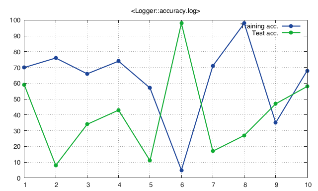

<a name='optim.logger'></a>
# Logger

`optim` provides also logging and live plotting capabilities via the `optim.Logger()` function.

Live logging is essential to monitor the *network accuracy* and *cost function* during training and testing, for spotting *under-* and *over-fitting*, for *early stopping* or just for monitoring the health of the current optimisation task.


## Logging data

Let walk through an example to see how it works.

We start with initialising our logger connected to a text file `accuracy.log`.

```lua
logger = optim.Logger('accuracy.log')
```

We can decide to log on it, for example, *training* and *testing accuracies*.

```lua
logger:setNames{'Training acc.', 'Test acc.'}
```

And now we can populate our logger randomly.

```lua
for i = 1, 10 do
   trainAcc = math.random(0, 100)
   testAcc = math.random(0, 100)
   logger:add{trainAcc, testAcc}
end
```

We can `cat` `accuracy.log` and see what's in it.

```
Training acc.   Test acc.
 7.0000e+01      5.9000e+01
 7.6000e+01      8.0000e+00
 6.6000e+01      3.4000e+01
 7.4000e+01      4.3000e+01
 5.7000e+01      1.1000e+01
 5.0000e+00      9.8000e+01
 7.1000e+01      1.7000e+01
 9.8000e+01      2.7000e+01
 3.5000e+01      4.7000e+01
 6.8000e+01      5.8000e+01
```

## Visualising logs

OK, cool, but how can we actually see what's going on?

To have a better grasp of what's happening, we can plot our curves.
We need first to specify the plotting style, choosing from:

  * `.` for dots
  * `+` for points
  * `-` for lines
  * `+-` for points and lines
  * `~` for using smoothed lines with cubic interpolation
  * `|` for using boxes
  * custom string, one can also pass custom strings to use full capability of gnuplot.

```lua
logger:style{'+-', '+-'}
logger:plot()
```



If we'd like an interactive visualisation, we can put the `logger:plot()` instruction within the `for` loop, and the chart will be updated at every iteration.

In case we'd like to prevent `gnuplot` to display the plots, we can set the option `logger:display(false)`.
In this way, plots will be saved but not displayed.
To restore the normal behaviour, use `logger:display(true)`.

We can set a logarithmic *y* axis with `logger:setlogscale(true)` and reset it with `logger:setlogscale(false)`.
